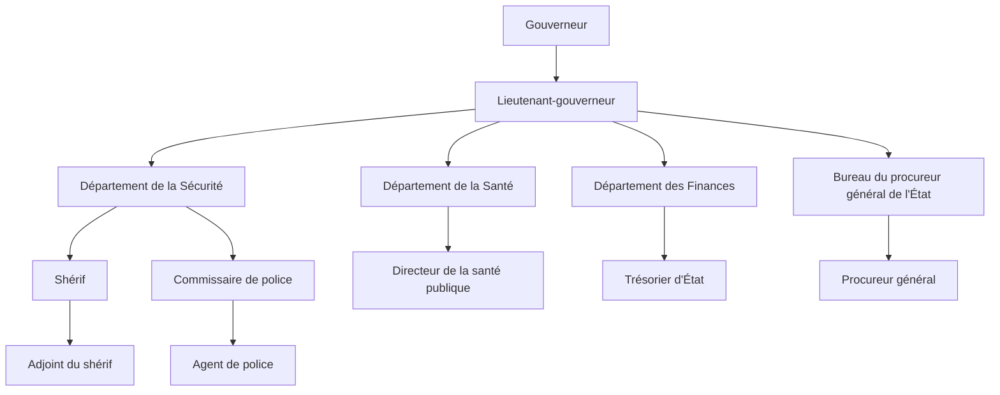
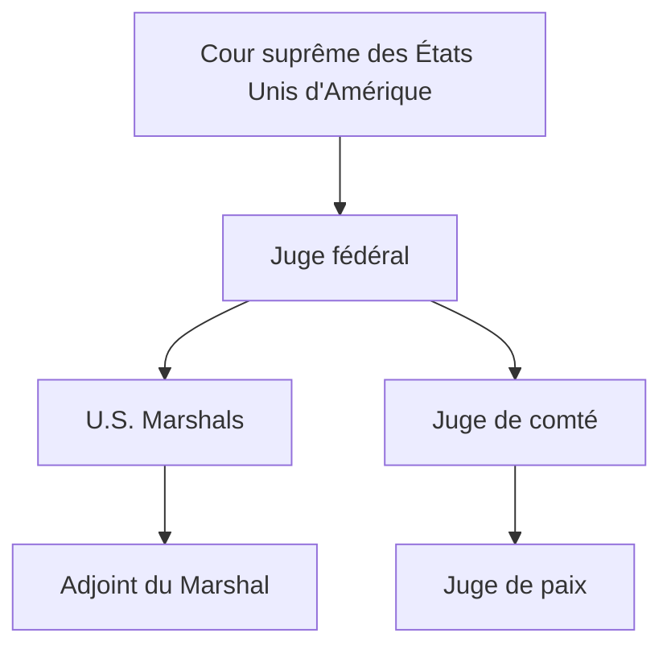

Cette page présente les deux structures institutionnelles : **le gouvernement de l'État** et **la justice**.

## Gouvernement de l'État

```mermaid
flowchart TD
    GOV["Gouverneur"] --> LT["Lieutenant-gouverneur"]

    LT --> SEC["Département de la Sécurité"]
    LT --> SAN["Département de la Santé"]
    LT --> FIN["Département des Finances"]
    LT --> BPG["Bureau du procureur général de l'État"]

    SEC --> SH["Shérif"]
    SEC --> CP["Commissaire de police"]
    SH --> AS["Adjoint du shérif"]
    CP --> AP["Agent de police"]

    SAN --> DSP["Directeur de la santé publique"]
    FIN --> TE["Trésorier d'État"]
    BPG --> PG["Procureur général"]
```

## Justice

```mermaid
flowchart TD
    CS["Cour suprême des États Unis d'Amérique"] --> JF["Juge fédéral"]

    JF --> USM["U.S. Marshals"]
    JF --> JC["Juge de comté"]

    USM --> AM["Adjoint du Marshal"]
    JC --> JP["Juge de paix"]
```
